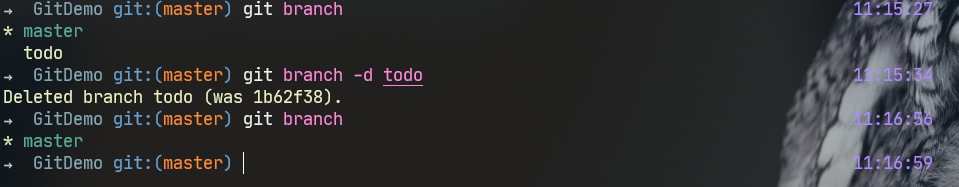

# Learn Git

[TOC]

## 1. 初始化

```bash
git init
```

+ 用`git init` 初始化文件夹；
+ 生成`.git`隐藏文件夹；
+ directory $\rightarrow$ repository


## 2. 查看repository状态

```bash
git status
```


+ `Untracked files`：没有被追踪的文件是无法被`git`管理保存的


## 3. 添加追踪文件

```bash
git add [filename]
git add . 
```

+ `git add .`：**添加所有文件**


### 3.1 修改追踪文件


+ 修改后的文件相当于存在两个版本，每次添加可以理解为更新一次文件

+ ```bash
  git diff
  ```

  + 显示`modified`和原添加文件之间的区别
  + 


### 3.2 重置添加文件

```bash
git reset
```


## 4. 提交修改

### 4.1 配置个人信息

```bash
git config --global user.name "name" 
git config --global user.email "email"
```

+ 设置提交的`name`以及`email`


### 4.2 提交此次修改

#### 4.2.1`-m` 

```bash
git commit -m "comment"
```


#### 4.2.2 无参数

```bash
git commit
```


+ 当不额外添加参数时，**呼出文本编辑器**
+ 同理，在第一行输入`comment`

```bash
git config --global core.editor [editor]
```

+ 通过上述指令修改`git commit`时呼出的文本编辑器

#### 4.2.3 `-a`

```bash
git commit -a
```

+ 添加并提交**已追踪的文件**


### 4.3 忽略管理

#### 4.3.1 设置忽略文件

> 用于管理放置在该文件夹下，但不希望git管理的文件，由`.gitignore`统一管理


+ 在`.gitignore`中添加需要屏蔽的**文件名**
+ **仅用于git还未追踪的文件**，倘若git已经在追踪该文件了，则即使在`.gitignore`里添加了文件名，git仍然会追踪修改。
+ 


#### 4.3.2 中断追踪

```bash
git rm --cached [filename]
```


+ 在git管理中删除了该文件，实际文件依然存在
+ 此时git真正意义上地停止追踪该文件
+ 


## 5. git分支

> 对`repository`有大面积修改时，类似于时间线分支，可用于**复原**与**发布**，不再需要复制该文件夹

### 5.1 创建分支并进入

```bash
git branch [branchname]
git checkout [branchname]
```


### 5.2 分支的切换

```bash
git checkout [branchname]
```

+ `todo`
  + 

+ `master`
  + 

> 通过`git checkout`的方法实现多个分支的切换，同一个repository可以有多个分支，**相当于有多个版本的repository**


### 5.3 分支的合并

```bash
git merge [branchname]
```

+ 将`branchname`的分支覆盖当前的分支，从而实现分支的合并（更新）

  + 

+ `覆盖`：实际上仅仅是覆盖掉当前的分支，并未删除`branchname`分支

  + 

  + ```bash
    git branch -d/-D [branchname] 
    ```


## 6. 提交远程

> `commit`or`branch`都只是在本地使用`git`对文件夹进行管理，实际上如果需要推送至网上，需要一个支持git的服务网站，如**Github，gitee**等。

### 6.1 添加远程地址

```bash
git remote add origin https://github.com/MMurphy98/LearnGit.git
```


### 6.2 上传分支

```bash
git push --set-upstream origin master
```


+ 每次需要输入用户名和密码

+ 记住用户名和密码：

  + ```bash
    git config credential.helper store
    ```


### 6.3 上传与下载

```bash
git clone [.... .git]
git push
git pull
```

+ `clone`：下载repository
+ `push`：将本地的分支上传至服务网站
+ `pull`：将网站上的项目更新至本地

